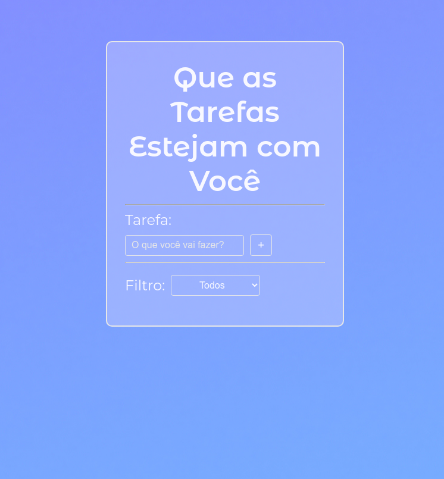

<h1 align="center"> ToDo List :memo:</h1>

  <a href="#-tecnologias">Tecnologias</a>&nbsp;&nbsp;&nbsp;|&nbsp;&nbsp;&nbsp;
  <a href="#-projeto">Projeto</a>&nbsp;&nbsp;&nbsp;|&nbsp;&nbsp;&nbsp;
  <a href="#memo-licença">Licença</a>

  

<h2 align="center"> Preview </h2>
  

  

## 🚀 Tecnologias

   
Esse projeto foi desenvolvido com as seguintes tecnologias:  
    
    
    

 
## 💻 Projeto

  <ul>
    <li>Autor : <a href="https://github.com/BerserKess">Kesley Rainery</a>
</li>
    <li>
Proposta: Criar uma lista para controle de tarefas do dia-a-dia
</li>
   </ul>
   

## 📝 Licença

Esse projeto está sob a licença MIT.
